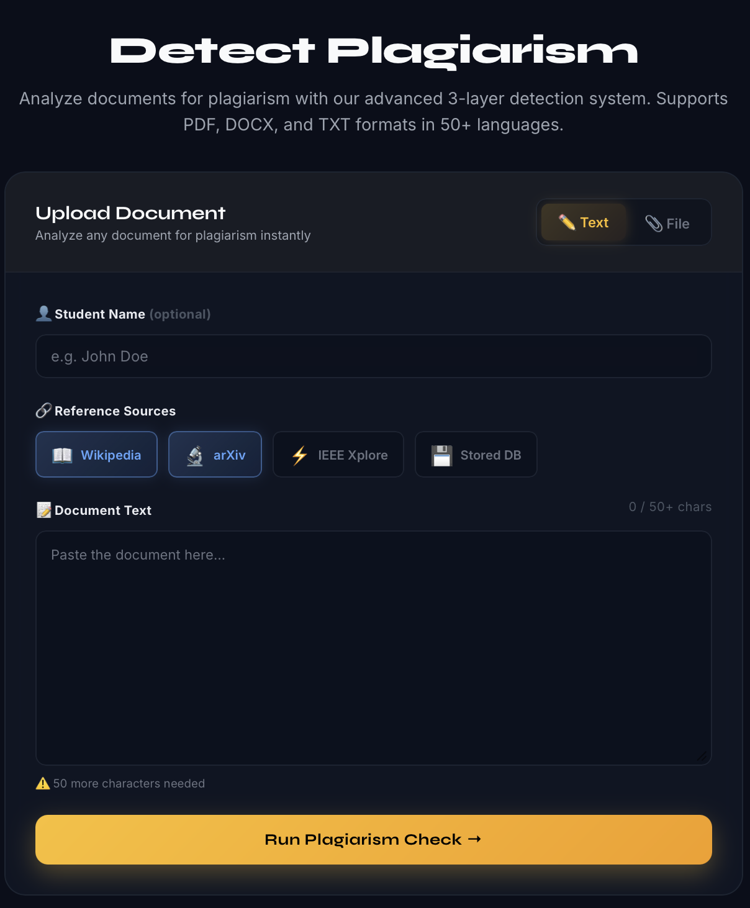

# Detect Plagiarism



Analyze documents for plagiarism with a 3-layer detection pipeline that supports `PDF`, `DOCX`, and `TXT` files across 50+ languages. The project combines exact matching, semantic similarity, paraphrase detection, AI-writing analysis, source-aware references, and batch comparison.

## Features

- 3-layer plagiarism detection:
  - exact / near-exact overlap
  - semantic similarity
  - paraphrase detection with NLI
- AI-generated content analysis
- Source-backed checking with:
  - `Wikipedia`
  - `arXiv`
  - `IEEE Xplore`
  - local stored corpus entries shown as `Database`
- Sentence-level highlighting with matched references
- Section-wise plagiarism heatmap
- Batch student comparison and network graph
- PDF report generation
- Stored corpus seeding from CSV / Kaggle-style datasets

## Tech Stack

- Frontend: React
- Backend: FastAPI + Uvicorn
- Vector Search: ChromaDB
- Database: MongoDB
- ML/NLP: SentenceTransformers, Transformers, PyTorch, scikit-learn, NLTK

## Detection Pipeline

1. Extract text from uploaded documents.
2. Split into sentences and filter cited content.
3. Build or query the corpus from selected sources.
4. Embed sentences with SBERT.
5. Run:
   - Layer 1: TF-IDF exact match
   - Layer 2: semantic similarity
   - Layer 3: NLI paraphrase detection
6. Aggregate document score, section scores, AI-detection result, and matched references.

## Project Structure

```text
api/         FastAPI routes and response shaping
detector/    Core pipeline, models, corpus, scoring, reporting
frontend/    React UI
extras/      Project assets and additional UI files
chroma_db/   Persistent vector corpus storage
```

Detailed project notes are available in [PROJECT_STRUCTURE.md](PROJECT_STRUCTURE.md).

## Local Setup

### Backend

```bash
python3 -m venv venv
source venv/bin/activate
pip install -r requirements.txt
uvicorn api.main:app --reload --port 8000
```

### Frontend

```bash
cd frontend
npm install
npm start
```

Frontend runs on `http://localhost:3000` and backend on `http://localhost:8000`.

## Environment Variables

Create a `.env` file in the project root if needed.

Typical values:

```env
MONGODB_URI=mongodb://localhost:27017
CORS_ORIGINS=http://localhost:3000
IEEE_XPLORE_API_KEY=your_key_here
```

## Notes

- `IEEE Xplore` requires a valid active IEEE API key.
- `Stored` references are local corpus entries and appear in the UI as `Database`.
- Batch comparison supports student-to-student similarity visualization.

## Deployment

Deployment notes are in [DEPLOYMENT.md](DEPLOYMENT.md).

